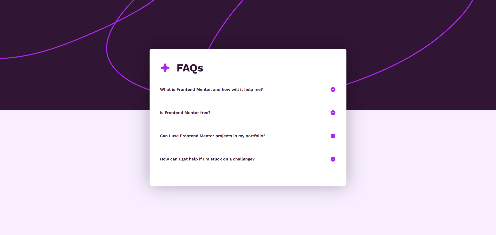

# FAQ accordion

Esta es una solución al [desafío de FAQ accordion en Frontend Mentor](https://www.frontendmentor.io/learning-paths/introduction-to-web-accessibility-mXu-9PHVsd/steps/68473d9a81440b1be56ee939/challenge/start). Los desafíos de Frontend Mentor ayudan a mejorar tus habilidades de programación creando proyectos realistas.

## Descripción general

### 📷 Captura de pantalla

### 🔗 Links
- [URL de la solución](https://www.frontendmentor.io/solutions/faq-accordion-solution-kmH1jSCKTI)
- [URL del sitio en vivo](https://braismarquez2025.github.io/FAQ-accordion/)

### 🔧 Llevado a cabo con
- HTML
- SCSS
- JavaScript
- GitHub Pages

### ✌️ Autor 
- 💼 GitHub - https://github.com/braismarquez2025
- ✉️ Gmail - braismarquez2003@gmail.com
- 👤 Usuario de Frontend - [@braismarquez2025](https://www.frontendmentor.io/profile/braismarquez2025)

